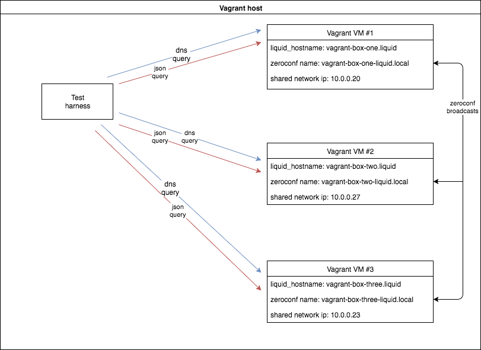

# Testing Discovery for Liquid Investigations

## What is being tested

[Zeroconf](https://en.wikipedia.org/wiki/Zero-configuration_networking) is
being used for discovery of the other nodes in a network. Each node publishes
itself as a `_liquid._tcp.local` service using
[avahi-daemon](https://packages.debian.org/jessie/avahi-daemon).

Each node in the network must have a unique hostname by which it will be
identified. For the test, the hostnames used are `vagrant-box-two.liquid`,
`vagrant-box-two.liquid`, and `vagrant-box-three.liquid`. The hostnames can
have any domain, like `my-pretty-box.me` or `the-cool-box.org`. The hostnames
should consist only of smallcase letters and the hyphen ('-'). The hostnames
must have a domain to work.

Each node will publish a zeroconf record of type `_liquid._tcp.local`, with the
following txt field:

    "liquid_hostname=the-hostname.liquid"

[The python-zeroconf](https://github.com/jstasiak/python-zeroconf) library does
the conversion between this data format and python dicts.


### The discovery

After a short time, the `avahi-daemon` instance of each node will discover the
other instances and their services. By using python-zeroconf, each node
receives notifications when other nodes appear and dissapear from the network.

The events are processed by the [python
module](https://github.com/liquidinvestigations/core/blob/master/liquidcore/home/discovery.py)
concerned with discovery. The module stores all the discovered nodes in a
memory store (implemented as a [python
dict](https://github.com/liquidinvestigations/core/blob/master/liquidcore/home/discovery.py#L6)
at the time of writing).


### The JSON endpoint

Each node has a JSON endpoint at `http://localhost:13777/nodes` that lists all
the nodes that it has discovered on the network, including itself.

For example, if a single node named "box-one" is running a hotspot on which it
is the only client, will have the following JSON response for GET requests at
`/nodes`:

    ```json
    {
      "wlan0": {
        "li-box-one._liquid._tcp.local.": {
          "address": "10.0.0.20",
          "discovered_at": "2017-07-24T11:52:37.454125",
          "hostname": "vagrant-box-one.liquid",
          "is_local": true
        }
      }
    }
    ```

_Note_: `wlan0` is the network interface on which the respective node `box-one`
has been discovered.


### Updating local DNS server records (for the user devices (laptops))

Each node has a `dnsmasq` DNS server installed and running.

The events that the `python-zeroconf` picks up are filtered automatically by
only keeping `_liquid._tcp.local` services that have a `liquid_hostname` key in
their `txt` (`properties` in `python-zeroconf`) zeroconf field.  Also, each
node discovered has to be manually confirmed by the node administrator from the
`liquid-core` interface.

The `liquid-core` instance inserts a record into its DNS server for each
discovered and confirmed node.

Dnsmasq does not support dynamic updating of DNS records. This means on each
event the Dnsmasq server will have to be restarted (which requires root
access). Dnsmasq is configured to use `/var/lib/liquid/conf/discover/dns.conf`
as a configuration file. The `liquid-core` service is being run by the `liquid`
user, that has write access to the `/var/lib/liquid/conf/discover/dns.conf`
file.

Each time the list of discovered and confirmed nodes changes, the `liquid-core`
service rewrites the `dns.conf` file. When the `dns.conf` file is changed, the
changes are picked up by a daemon running `inotifywait` and Dnsconf gets
restarted.


## About the VMs

The zeroconf and DNS test harness uses Vagrant to create a suitable testing
environment, consisting of multiple machines in a single, private network.

The
[Vagrantfile](https://github.com/liquidinvestigations/setup/blob/master/test/zeroconf/Vagrantfile)
provisions three VMs, named "one", "two" and "three", starting from an x64
Ubuntu 16.04 image.

The Liquid Investigations software gets installed on each one of those VMs.
The only differences between these machines are:

- ip address on the shared network
- `liquid_domain` configuration string given to the [ansible
  scripts](https://github.com/liquidinvestigations/setup/tree/avahi-daemon).
  Also, it's being set in `/etc/hosts` to `127.0.0.1` and in `/etc/hostname` by
  the provisioning script in the Vagrantfile. Thus, the `liquid_domain`
  configuration also sets the machine hostname.
- `.local` address used to publish the service, because using non-`.local`
  domains with zeroconf is unstable and largely undocumented. This address is
  chosen automatically by `avahi-daemon`, being derived from the hostname.


## Provisioning multiple Vagrant VMs with the Liquid Investigations software

When using [Vagrant in multi-machine mode](link), the VMs are started and
provisioned one at a time, starting from a Vagrant `.box` pre-loaded with the
Liquid Investigations software hosted at [our
website](liquidinvestigations.org/images).


## Network architecture for testing

_Note_: When implementing the tests, the host machine used Vagrant 1.9.5 and
VirtualBox 5.1.12.

On each node, we set the following:
- ip address
- `liquid_domain`

The topology of the network is described in the following diagram, along with
the configuration values for the thigs listed above:



The test harness connects to each VM through `vagrant ssh one`, `vagrant ssh
two` and so on. It tries to connect to the JSON endpoint at the current
hostname and to the DNS server that is running on the VM itself. The expected
value sets for node "one" are displayed below.

The current testing configuration only connects nodes through a single
interface. At the time of writing, connecting nodes through multiple interfaces
is not supported.


### Testing the `/nodes` endpoint on each node

    Running as the `vagrant` user, on VM "one", through ssh:

        GET http://localhost:13777/nodes

    Response:

    ```json
    {
      "eth0": {
        "li-vagrant-box-one-liquid._liquid._tcp.local.": {
          "address": "10.0.0.20",
          "discovered_at": "2017-07-24T11:52:37.454125",
          "hostname": "vagrant-box-one.liquid",
          "is_local": true
        },
        "li-vagrant-box-two-liquid._liquid._tcp.local.": {
          "address": "10.0.0.27",
          "discovered_at": "2017-07-24T11:52:37.413575",
          "hostname": "vagrant-box-two.liquid",
          "is_local": false
        }
        "li-vagrant-box-three-liquid._liquid._tcp.local.": {
          "address": "10.0.0.23",
          "discovered_at": "2017-07-24T11:52:37.429687",
          "hostname": "vagrant-box-three.liquid",
          "is_local": false
        }
      }
    }
    ```


### Testing the DNS server on each node

The DNS server on all nodes must have the following records:

    vagrant-box-one.liquid    A   10.0.0.20
    vagrant-box-two.liquid    A   10.0.0.27
    vagrant-box-three.liquid  A   10.0.0.23

