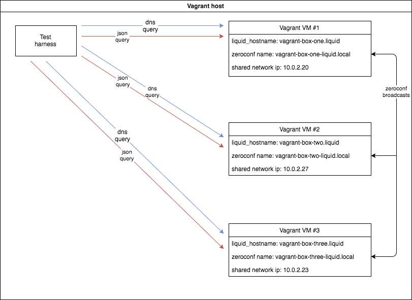

# Testing zeroconf with DNS for Liquid Investigations

## What is being tested

[Zeroconf](wikipedia) is being used for discovery of the other nodes in a network. Each node publishes itself in two ways:
- as a `_workstation._tcp.local` service (because avahi-daemon is started and does this by default)
- as a `_http._tcp.local` service, used to publish the fact that the node has the Liquid Investigations software running, along with arbitrary metadata.

Each node in the network must have a unique hostname by which it will be identified. For the test, the hostnames used are `vagrant-box-two.liquid`, `vagrant-box-two.liquid`, and `vagrant-box-three.liquid`. The hostnames can have any domain, like `my-pretty-box.me` or `the-cool-box.org`. The hostnames should consist only of smallcase letters and the hyphen ('-').

Each node will publish a zeroconf record of type `_http._tcp.local`, with the following txt field:

    "liquid_hostname=the-hostname.liquid"

[The python-zeroconf](https://github.com/jstasiak/python-zeroconf) library does the conversion between this data format and python dicts.

### The discovery

After a short time, the `avahi-daemon` instance of each node will discover the other instances and their services. By using python-zeroconf, each node receives notifications when other nodes appear and dissapear from the network.

The events are processed by the [python module](https://github.com/liquidinvestigations/core/blob/use-zeroconf/liquidcore/home/discovery.py) concerned with discovery. The module stores all the discovered nodes in a memory store (implemented as a [python dict](https://github.com/liquidinvestigations/core/blob/use-zeroconf/liquidcore/home/discovery.py#L6) at the time of writing).

### The JSON endpoint

Each node has a JSON endpoint
TODO: txt

### Updating local DNS server records (for the user devices (laptops))

TODO: more txt

## About the VMs

The zeroconf and DNS test harness uses Vagrant to create a suitable testing environment, consisting of multiple machines in a single, private network.

The [Vagrantfile](https://github.com/liquidinvestigations/setup/blob/avahi-daemon/test/zeroconf/Vagrantfile) provisions three VMs, named "one", "two" and "three", starting from an x64 Ubuntu 16.04 image.

The Liquid Investigations software gets installed on each one of those VMs.
The only differences between these machines are:

- ip address
- `liquid_domain` configuration string given to the [ansible scripts](https://github.com/liquidinvestigations/setup/tree/avahi-daemon)

The `liquid_domain` configuration also sets the machine hostname.

## Provisioning multiple Vagrant VMs with the Liquid Investigations software

When using [Vagrant in multi-machine mode](link), the VMs are started and provisioned one at a time.

Since the machines only differ in configuration, provisioning each VM from scratch is a waste of time and bandwidth.
Thus, the provisioning process is split into the following steps:

- machine "one" is created from the Ubuntu box
- machine "one" is then provisioned with the ansible scripts
- machine "one" is packaged in the `.box` format using `vagrant package`, creating `liquid-zeroconf.box`
- machines "two" and "three" are created from the `liquid-zeroconf.box` file. They only get reconfigured by re-running the provisioning on the `liquid-zeroconf.box`

The provisioning takes a noticeably shorter amount of time when starting from a pre-provisioned image instead of a fresh Ubuntu image, as Ansible detects what has changed and what has not.

## Network architecture for testing

_Note_: When implementing the tests, the host machine used Vagrant 1.9.5 and VirtualBox 5.1.12.

Each VM has 
TODO: txt

